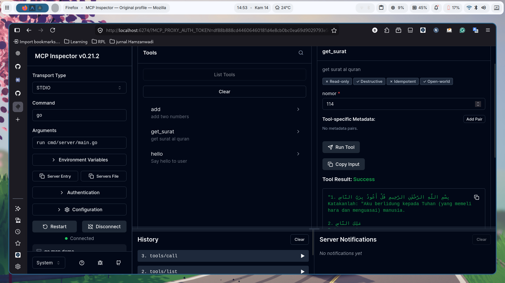

# Go MCP Demo

Proyek ini adalah contoh implementasi server [Model Context Protocol (MCP)](https://modelcontextprotocol.io) yang ditulis menggunakan bahasa pemrograman Go. Server ini menyediakan beberapa *tools* (alat) sederhana yang dapat dipanggil oleh klien MCP (seperti Claude Desktop atau AI Agent lainnya) melalui standar komunikasi STDIO.

## Fitur (Tools)

Server MCP ini mengekspos 3 (tiga) alat yang dapat digunakan:

1. **`hello`**
   - **Deskripsi:** Mengucapkan salam kepada pengguna.
   - **Parameter:** 
     - `name` (string, wajib): Nama pengguna.
2. **`add`**
   - **Deskripsi:** Menjumlahkan dua buah angka.
   - **Parameter:**
     - `a` (number, wajib): Angka pertama.
     - `b` (number, wajib): Angka kedua.
3. **`get_surat`**
   - **Deskripsi:** Mengambil data ayat-ayat dari suatu Surat Al-Qur'an berdasarkan nomor urut suratnya.
   - **Parameter:**
     - `nomor` (number, wajib): Nomor surat (misalnya 1 untuk Al-Fatihah, 114 untuk An-Nas).

## Struktur Proyek

Berikut adalah struktur direktori proyek Go MCP Demo:

```
go-mcp/
├── cmd/
│   └── server/
│       └── main.go           # Entry point dan konfigurasi MCP server
├── internal/
│   ├── handlers/
│   │   ├── hello.go          # Handler untuk tool hello
│   │   ├── add.go            # Handler untuk tool add
│   │   └── surat.go          # Handler untuk tool get_surat
│   ├── models/
│   │   └── surat.go          # Model data untuk surat Al-Qur'an
│   ├── services/
│   │   └── surat_service.go  # Service logic untuk pengambilan data surat
│   └── tools/
│       ├── hello_tool.go     # Definisi tool hello
│       ├── add_tool.go       # Definisi tool add
│       └── surat_tool.go     # Definisi tool get_surat
├── go.mod                     # File dependensi Go
├── go.sum                     # Checksum dependensi
├── README.md                  # Dokumentasi proyek
└── image.png                  # Gambar demo project dengan MCP Inspector
```

### Penjelasan Struktur

#### **Folder `cmd/`**
- Berisi entry point aplikasi dan konfigurasi utama
- **`cmd/server/main.go`** - File utama yang menginisialisasi MCP server, mendaftarkan semua tools, dan menangani komunikasi STDIO dengan klien MCP

#### **Folder `internal/`**
- Berisi kode internal yang tidak diekspor ke luar package
- Mengikuti pola arsitektur yang terorganisir dengan baik

##### **`internal/handlers/`**
- Berisi handler untuk setiap tool yang menangani logika bisnis
- **`hello.go`** - Handler untuk tool hello yang memproses permintaan salam
- **`add.go`** - Handler untuk tool add yang memproses operasi penjumlahan
- **`surat.go`** - Handler untuk tool get_surat yang memproses permintaan data surat

##### **`internal/models/`**
- Berisi definisi struktur data yang digunakan dalam aplikasi
- **`surat.go`** - Model data untuk representasi surat dan ayat Al-Qur'an

##### **`internal/services/`**
- Berisi service layer yang mengandung logika bisnis kompleks
- **`surat_service.go`** - Service untuk mengambil dan memproses data surat Al-Qur'an

##### **`internal/tools/`**
- Berisi definisi dan konfigurasi MCP tools
- **`hello_tool.go`** - Definisi tool hello dengan parameter dan deskripsi
- **`add_tool.go`** - Definisi tool add dengan parameter dan deskripsi
- **`surat_tool.go`** - Definisi tool get_surat dengan parameter dan deskripsi

#### **File Konfigurasi**
- **`go.mod`** - File modul Go yang mendefinisikan nama modul dan dependensi eksternal
- **`go.sum`** - File checksum yang memastikan integritas dependensi
- **`README.md`** - Dokumentasi lengkap proyek
- **`image.png`** - Screenshot demo project saat diuji dengan MCP Inspector

### Arsitektur Project

Project ini mengikuti pola arsitektur yang bersih dengan pemisahan tanggung jawab yang jelas:

1. **Presentation Layer** (`cmd/server/`) - Menangani inisialisasi server dan routing
2. **Handler Layer** (`internal/handlers/`) - Menangani request dan response
3. **Service Layer** (`internal/services/`) - Mengandung logika bisnis
4. **Model Layer** (`internal/models/`) - Definisi struktur data
5. **Tools Layer** (`internal/tools/`) - Konfigurasi MCP tools

## Demo Project

Berikut adalah tampilan demo project saat diuji menggunakan **MCP Inspector**:



Gambar di atas menunjukkan antarmuka MCP Inspector saat menjalankan dan menguji tools yang tersedia di server MCP ini, termasuk `hello`, `add`, dan `get_surat`.

## Prasyarat

Pastikan Anda telah menginstal:
- [Go](https://go.dev/dl/) (versi 1.18 ke atas disarankan)

## Instalasi

1. Clone atau unduh repositori ini.
2. Buka terminal dan masuk ke direktori proyek:
   ```bash
   cd go-mcp
   ```
3. Unduh semua dependensi yang dibutuhkan:
   ```bash
   go mod tidy
   ```

## Penggunaan

Karena server ini adalah MCP Server yang menggunakan komunikasi STDIO, server ini tidak dirancang untuk dijalankan sebagai API HTTP biasa, melainkan untuk diintegrasikan dan dipanggil langsung oleh Client MCP.

Anda dapat mem-build proyek ini menjadi sebuah berkas *executable*:

```bash
go build -o go-mcp-server cmd/server/main.go
```

Atau bisa dijalankan langsung (biasanya dikonfigurasi pada Client MCP):

```bash
go run cmd/server/main.go
```

### Integrasi dengan Claude Desktop App

Untuk menggunakan alat-alat ini di dalam Claude Desktop, Anda perlu mendaftarkan server ini ke dalam konfigurasi Claude. 

Buka berkas konfigurasi Claude Desktop Anda:
- **Windows:** `%APPDATA%\Claude\claude_desktop_config.json`
- **macOS:** `~/Library/Application Support/Claude/claude_desktop_config.json`

Tambahkan atau modifikasi menjadi seperti ini:

```json
{
  "mcpServers": {
    "go-mcp-demo": {
      "command": "go",
      "args": [
        "run",
        "/path/to/your/go-mcp/cmd/server/main.go"
      ]
    }
  }
}
```
> **Catatan:** Ganti `/path/to/your/go-mcp/cmd/server/main.go` dengan *absolute path* (path lengkap) menuju lokasi file `main.go` di komputer Anda, atau gunakan path menuju *executable* hasil build sebelumnya.

Setelah Anda menyimpan file tersebut, silakan mulai ulang (restart) Claude Desktop. Anda seharusnya sudah bisa meminta Claude untuk:
- "Tolong panggil tool hello dengan nama Budi"
- "Jumlahkan 100 dan 55 menggunakan tool add"
- "Tampilkan surat ke-1 menggunakan get_surat"

### Testing dengan MCP Inspector

Anda juga bisa melakukan pengujian (testing) server MCP ini secara interaktif dan memastikan semua fungsi berjalan lancar menggunakan alat pembantu resmi, yaitu [MCP Inspector](https://github.com/modelcontextprotocol/inspector).

Untuk menjalankan inspector, pastikan sistem Anda sudah terinstal `npx` (bawaan dari Node.js), lalu jalankan perintah berikut pada terminal di direktori proyek:

```bash
npx @modelcontextprotocol/inspector go run cmd/server/main.go
```

Perintah di atas akan memulai inspector yang bisa dibuka melalui *browser* Anda (secara default di `http://localhost:5173`). Di sana, Anda bisa melihat, mengatur parameter, dan menjalankan operasi `hello`, `add`, dan `get_surat` secara praktis lewat antarmuka GUI sebelum diintegrasikan di aplikasi klien MCP.

## Dependensi

Proyek ini menggunakan *library*:
- `github.com/mark3labs/mcp-go/mcp`
- `github.com/mark3labs/mcp-go/server`

---
Dibuat sebagai contoh pembelajaran Model Context Protocol (MCP) dengan Go.
